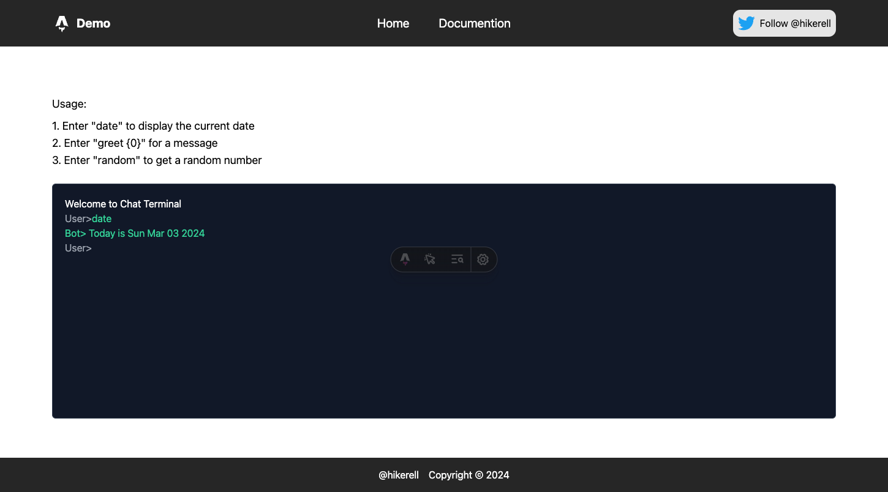

# Astro + Primevue + Tailwind Demo

Astro, PrimeVue and Tailwind are all excellent front-end frameworks. Since PrimeVue now fully supports integration with Tailwind, but PrimeVue official only provides usage guides for Vite and Nuxt, I'm providing an integration sample reference for Astro.

## Reference
* [Astro Installation Guide](https://docs.astro.build/en/install/auto/)
* [Astro + Tailwind Integration Guide](https://docs.astro.build/en/guides/integrations-guide/tailwind/)
* [Astro + Vue Integration Guide](https://docs.astro.build/en/guides/integrations-guide/vue/)
* [Primevue + Tailwind + Vite Integration Guide](https://tailwind.primevue.org/vite/)
